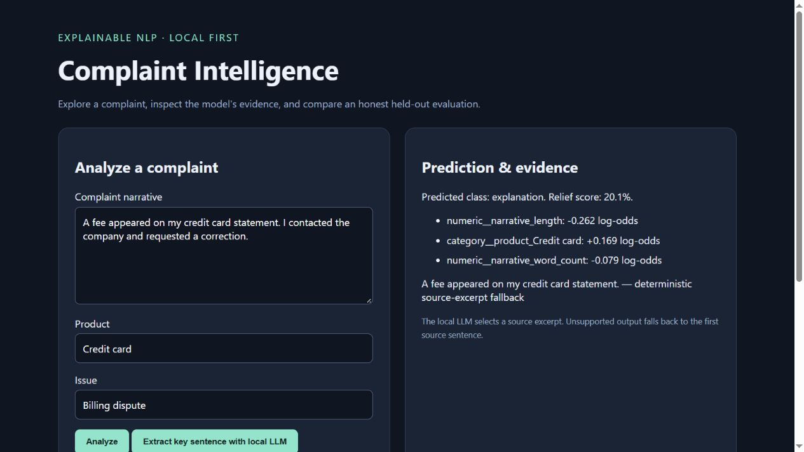
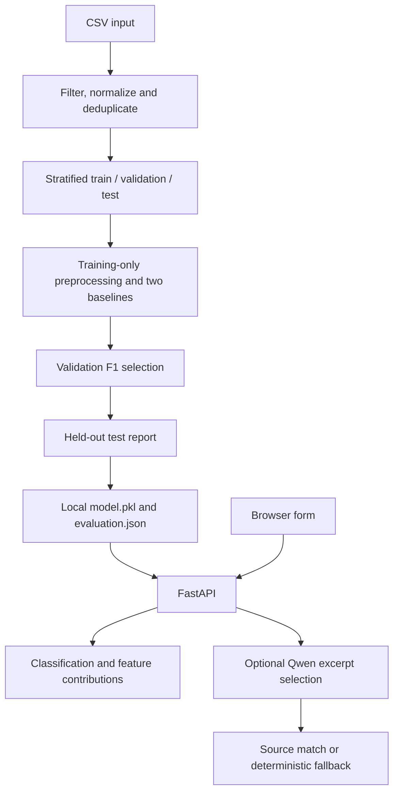

# Complaint Intelligence

[](https://github.com/dilarakoru/complaint-intelligence/actions/workflows/ci.yml)

A local-first NLP application that classifies complaint outcomes, explains the deployed model's feature contributions and optionally selects a source-grounded excerpt with Qwen. Built with **Python, scikit-learn, FastAPI and Transformers**.

The engineering focus is the path from imperfect data to an inspectable product: find leakage, establish baselines, separate selection from evaluation, and expose predictions through a browser and API.



**Contents:** [Data](#data-and-target) · [Architecture](#architecture) · [Methods](#methods) · [Results](#results) · [Run](#installation) · [API](#api) · [Tests](#tests-and-validation)

## Problem and user flow

Given a complaint narrative and structured attributes, estimate whether its recorded response belongs to a relief category or an explanation category. The user submits details, inspects the classification and feature contributions, and optionally requests a grounded excerpt. The evaluation endpoint makes the active model's evidence accessible alongside its prediction.

This predicts a recorded response category, not severity, sentiment or customer satisfaction. It is a research demonstration, not a financial decision system or an individual outcome guarantee.

## Data and target

| Dataset | Origin and purpose | Size | Published? |
|---|---|---:|---|
| Synthetic demo | Artificial scenarios and demo identifiers; installation and pipeline checks | 120 rows | Yes: [data/demo.csv](data/demo.csv) |
| Local research sample | Existing project CSV; the original acquisition script targets the CFPB Consumer Complaint Database API | 400 raw; 151 cleaned | No: raw narratives remain local |

The original acquisition script identifies CFPB as its intended source. An exact collection date and complete acquisition manifest were not available; this sample must not be described as representative of the full database. The evaluation records the SHA-256 of the actual input. Normal installation does not download complaint data.

### Schema and labels

| Column | Role | Handling |
|---|---|---|
| `complaint_id` | Identity and leakage checks | Required; loaded as a string; never used as a predictor |
| `complaint_what_happened` | Narrative | Required; blank narratives removed |
| `company_response` | Target source | Only the three supported response types retained; never used as a predictor |
| `product`, `sub_product`, `issue`, `sub_issue`, `company` | Categorical predictors | Missing/blank values become `Unknown` |
| `narrative_length`, `narrative_word_count` | Numeric predictors | Computed from the narrative |

Target **0 / explanation** is `Closed with explanation`. Target **1 / relief** combines `Closed with monetary relief` and `Closed with non-monetary relief`. `state` is normalized by the loader but is not included in the selected feature list.

### Cleaning and splitting

1. Filter unsupported response types and empty narratives.
2. Case-fold text and collapse whitespace to build a normalized text identity.
3. Exclude IDs or text identities with conflicting response labels. These checks use the original response labels, including the distinction between monetary and non-monetary relief.
4. Remove duplicate IDs and normalized narratives.
5. Make stratified **60/20/20** train/validation/test splits with seed **42**.
6. Assert zero ID and normalized-text overlap between each pair of splits.
7. Fit all learned preprocessing on training data only; select using validation F1; evaluate the selected training fit on test without refitting on validation.

The earlier split had 66/80 test rows sharing IDs with training and 68/80 sharing narratives. Its reported 0.875 accuracy is not independent performance evidence. The corrected version also changes the modeling approach, so the scores are not a controlled before/after model comparison.

## Architecture



Training and serving are separate. The API loads and caches a locally generated classifier on first prediction. Qwen is lazy-loaded only when enabled and requested. No database, account service or paid model API is required.

## Methods

| Stage | Implementation | Rationale |
|---|---|---|
| Categories | One-hot encoding with unknown categories ignored | Robust inference with categories absent from training |
| Numeric values | StandardScaler on length and word count | Consistent feature scaling |
| Optional text features | TF-IDF, unigrams/bigrams, 2,000-feature cap, sublinear TF | Reproducible classical text baseline |
| Classifier | Logistic regression, balanced class weights, 1,500 maximum iterations | Inspectable reference model for a small dataset |
| Selection | Validation F1 for the relief class | Keep selection separate from final test |
| Explanation | Transformed feature value multiplied by its coefficient | Faithful linear log-odds contributions |

The **structured baseline** uses categories and length features; the **text hybrid** adds TF-IDF. Both are fitted on training data only. TF-IDF is not an LLM embedding. The UI shows up to eight nonzero contributions with largest absolute magnitude. These are not SHAP values or causal effects. The intercept and smaller contributions are omitted from the display, so the displayed list is not the full score decomposition.

Historical PCA, XGBoost/LightGBM and SHAP modules are kept under [research/](research/) for context; they are not the supported training or serving pipeline.

### Optional local LLM

`Qwen/Qwen2.5-0.5B-Instruct` runs through Transformers on CPU in float32. It sees at most the first 2,000 input characters and generates at most 100 new tokens without sampling. It is asked to copy one informative source sentence.

After whitespace normalization, the candidate must be at least 20 characters and occur in the source. Otherwise the first source sentence is returned with the explicit method label `deterministic source-excerpt fallback`. This rejects unsupported generated text but does not establish excerpt usefulness or completeness. LLM output never changes the classifier result.

## Results

Source: [machine-readable local evaluation](docs/evaluation-local.json). Positive class: relief. These are local research results, not synthetic quick-start scores.

| Stage | Records |
|---|---:|
| Raw input | 400 |
| After filtering, conflict exclusion and deduplication | 151 |
| Removed by the combined cleaning process | 249 |
| Train / validation / test | 90 / 30 / 31 |
| ID overlap / normalized-text overlap | 0 / 0 |

| Validation model | Accuracy | Precision | Recall | F1 | ROC-AUC |
|---|---:|---:|---:|---:|---:|
| Structured baseline **(selected)** | 0.5667 | 0.5455 | 0.4286 | **0.4800** | 0.5714 |
| Structured + TF-IDF | 0.5333 | 0.5000 | 0.4286 | 0.4615 | 0.5625 |

| Selected model, held-out test | Value |
|---|---:|
| Accuracy | 0.5806 |
| Precision | 0.5294 |
| Recall | 0.6429 |
| F1 | 0.5806 |
| ROC-AUC | 0.6807 |

Confusion matrix (rows actual, columns predicted):

| | Predicted explanation | Predicted relief |
|---|---:|---:|
| Actual explanation | 9 | 8 |
| Actual relief | 5 | 9 |

Adding TF-IDF did not improve validation F1 in this experiment. With only 31 test records, results are exploratory and sensitive to sampling. Exact deduplication does not address paraphrases, temporal shift or company overlap. Synthetic scores demonstrate pipeline execution, not generalization.

## Installation

Requirements: **Python 3.10**, Git and internet access for initial package installation. CPU is sufficient. Use a separate environment.

```bash
git clone https://github.com/dilarakoru/complaint-intelligence.git
cd complaint-intelligence
python -m venv .venv
```

Activate on Windows PowerShell:

```powershell
.\.venv\Scripts\Activate.ps1
```

Or on macOS/Linux:

```bash
source .venv/bin/activate
```

Then install, train the included synthetic demo, and serve:

```bash
python -m pip install -r requirements.txt
python train.py
python -m uvicorn app:app --host 127.0.0.1 --port 8001
```

Open **http://127.0.0.1:8001**; interactive API docs: **http://127.0.0.1:8001/docs**. Training writes ignored `artifacts/model.pkl` and `artifacts/evaluation.json`. Quick-start metrics may differ from the research table because the data is synthetic.

For your own authorized CSV matching the schema:

```bash
python train.py --data data/local/complaints_raw.csv --output artifacts --seed 42
```

Use `--synthetic` when an alternative CSV is also synthetic. Restart the server after replacing an artifact because the loaded classifier is cached.

### Enable Qwen

```powershell
python -m pip install -r requirements-llm.txt
$env:ENABLE_LOCAL_LLM='1'
$env:ALLOW_MODEL_DOWNLOAD='1'
python -m uvicorn app:app --host 127.0.0.1 --port 8001
```

The first summary request may download weights. After caching, restart without `ALLOW_MODEL_DOWNLOAD=1` to use local-only loading. POSIX shells use `export ENABLE_LOCAL_LLM=1` and `export ALLOW_MODEL_DOWNLOAD=1`. CPU generation can be slow; no latency benchmark is claimed.

| Environment variable | Default | Purpose |
|---|---|---|
| `COMPLAINT_ARTIFACTS` | Project `artifacts/` | Model/report directory |
| `ENABLE_LOCAL_LLM` | Disabled | `1` enables summaries |
| `ALLOW_MODEL_DOWNLOAD` | Disabled | `1` allows initial weight download |

`.env.example` documents settings; the app reads process environment variables and does not automatically load a `.env` file.

## API

| Endpoint | Behavior |
|---|---|
| `GET /health` | Artifact-file presence and LLM-enabled flag; not full model validation |
| `GET /api/evaluation` | Active artifact's evaluation report |
| `POST /api/predict` | Classification, score and feature contributions |
| `POST /api/summarize` | Excerpt, grounding flag and method label |

PowerShell example:

```powershell
$body = @{ text='I was charged twice for the same purchase and contacted the company for a review.'; product='Credit card'; issue='Billing dispute'; company='Demo Company' } | ConvertTo-Json
Invoke-RestMethod -Method Post -Uri http://127.0.0.1:8001/api/predict -ContentType 'application/json' -Body $body
```

Prediction response fields: `prediction`, `probability`, `contributions`, `note`. Despite the field name, `probability` is an uncalibrated score. Text must contain 20–10,000 characters. Invalid payloads return 422; missing model/report or unavailable LLM returns 503.

## Tests and validation

```bash
python -m unittest discover -s tests -v
```

Four tests cover conflicting duplicate labels, split isolation, invented-excerpt rejection and synthetic end-to-end training/API behavior, including invalid requests and disabled LLM handling. CI uses Python 3.10. These checks establish software behavior, not predictive quality.

| Issue | Resolution |
|---|---|
| Model missing | Run training; verify `COMPLAINT_ARTIFACTS` |
| Summary unavailable | Install optional dependencies, enable LLM, prepare cached weights |
| Old predictions after retraining | Restart the API to refresh the model cache |
| Custom dataset rejected | Check schema, supported labels, at least 30 cleaned records and at least 6 per class |

## Repository structure

```text
app.py                  API and linear explanations
train.py                Splits, baselines, selection and metrics
data_loader.py          Deterministic cleaning and deduplication
llm_processor.py        Optional Qwen and source-grounding validation
data/demo.csv           Synthetic fixture
templates/index.html    Browser UI
docs/                   Evaluation, screenshot, decisions and provenance
research/               Historical unsupported experiments
tests/                  Automated tests
.github/workflows/      CI
```

